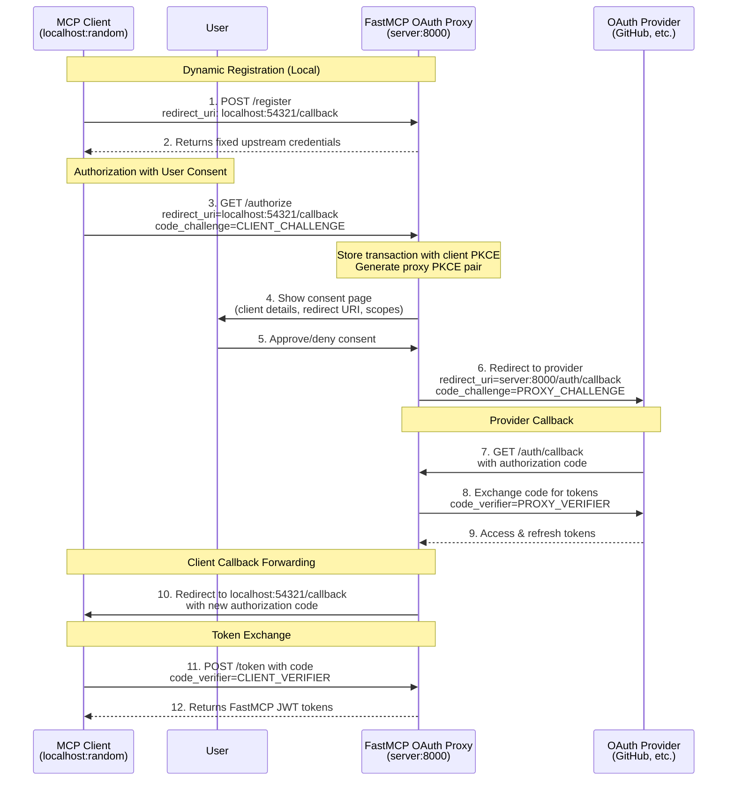

# OAuth Proxy

> Bridge traditional OAuth providers to work seamlessly with MCP's authentication flow.

The OAuth proxy enables FastMCP servers to authenticate with OAuth providers that **don't support Dynamic Client Registration (DCR)**. This includes virtually all traditional OAuth providers: GitHub, Google, Azure, AWS, Discord, Facebook, and most enterprise identity systems. For providers that do support DCR (like Descope and WorkOS AuthKit), use `RemoteAuthProvider` instead.

MCP clients expect to register automatically and obtain credentials on the fly, but traditional providers require manual app registration through their developer consoles. The OAuth proxy bridges this gap by presenting a DCR-compliant interface to MCP clients while using your pre-registered credentials with the upstream provider. When a client attempts to register, the proxy returns your fixed credentials. When a client initiates authorization, the proxy handles the complexity of callback forwarding—storing the client's dynamic callback URL, using its own fixed callback with the provider, then forwarding back to the client after token exchange.

This approach enables any MCP client (whether using random localhost ports or fixed URLs like Claude.ai) to authenticate with any traditional OAuth provider, all while maintaining full OAuth 2.1 and PKCE security.

> **Note:** For providers that support OIDC discovery (Auth0, Google with OIDC
  configuration, Azure AD), consider using `OIDC
    Proxy` for automatic configuration. OIDC Proxy
  extends the OAuth proxy to automatically discover endpoints from the provider's
  `/.well-known/openid-configuration` URL, simplifying setup.


## Implementation

### Provider Setup Requirements

Before using the OAuth proxy, you need to register your application with your OAuth provider:

1. **Register your application** in the provider's developer console (GitHub Settings, Google Cloud Console, Azure Portal, etc.)
2. **Configure the redirect URI** as your FastMCP server URL plus your chosen callback path:
   * Default: `https://your-server.com/auth/callback`
   * Custom: `https://your-server.com/your/custom/path` (if you set `redirect_path`)
   * Development: `http://localhost:8000/auth/callback`
3. **Obtain your credentials**: Client ID and Client Secret
4. **Note the OAuth endpoints**: Authorization URL and Token URL (usually found in the provider's OAuth documentation)

> **Warning:** The redirect URI you configure with your provider must exactly match your
  FastMCP server's URL plus the callback path. If you customize `redirect_path`
  in the OAuth proxy, update your provider's redirect URI accordingly.


### Basic Setup

Here's how to implement the OAuth proxy with any provider:

```python
from fastmcp import FastMCP
from fastmcp.server.auth import OAuthProxy
from fastmcp.server.auth.providers.jwt import JWTVerifier

# Configure token verification for your provider
# See the Token Verification guide for provider-specific setups
token_verifier = JWTVerifier(
    jwks_uri="https://your-provider.com/.well-known/jwks.json",
    issuer="https://your-provider.com",
    audience="your-app-id"
)

# Create the OAuth proxy
auth = OAuthProxy(
    # Provider's OAuth endpoints (from their documentation)
    upstream_authorization_endpoint="https://provider.com/oauth/authorize",
    upstream_token_endpoint="https://provider.com/oauth/token",

    # Your registered app credentials
    upstream_client_id="your-client-id",
    upstream_client_secret="your-client-secret",

    # Token validation (see Token Verification guide)
    token_verifier=token_verifier,

    # Your FastMCP server's public URL
    base_url="https://your-server.com",

    # Optional: customize the callback path (default is "/auth/callback")
    # redirect_path="/custom/callback",
)

mcp = FastMCP(name="My Server", auth=auth)
```

### Configuration Parameters


  
    URL of your OAuth provider's authorization endpoint (e.g., `https://github.com/login/oauth/authorize`)
  

  
    URL of your OAuth provider's token endpoint (e.g.,
    `https://github.com/login/oauth/access_token`)
  

  
    Client ID from your registered OAuth application
  

  
    Client secret from your registered OAuth application
  

  
    A `TokenVerifier` instance to validate the
    provider's tokens
  

  
    Public URL where OAuth endpoints will be accessible, **including any mount path** (e.g., `https://your-server.com/api`).

    This URL is used to construct OAuth callback URLs and operational endpoints. When mounting under a path prefix, include that prefix in `base_url`. Use `issuer_url` separately to specify where auth server metadata is located (typically at root level).
  

  
    Path for OAuth callbacks. Must match the redirect URI configured in your OAuth
    application
  

  
    Optional URL of provider's token revocation endpoint
  

  
    Issuer URL for OAuth authorization server metadata (defaults to `base_url`).

    When `issuer_url` has a path component (either explicitly or by defaulting from `base_url`), FastMCP creates path-aware discovery routes per RFC 8414. For example, if `base_url` is `http://localhost:8000/api`, the authorization server metadata will be at `/.well-known/oauth-authorization-server/api`.

    **Default behavior (recommended for most cases):**

    ```python
    auth = GitHubProvider(
        base_url="http://localhost:8000/api",  # OAuth endpoints under /api
        # issuer_url defaults to base_url - path-aware discovery works automatically
    )
    ```

    **When to set explicitly:**
    Set `issuer_url` to root level only if you want multiple MCP servers to share a single discovery endpoint:

    ```python
    auth = GitHubProvider(
        base_url="http://localhost:8000/api",
        issuer_url="http://localhost:8000"  # Shared root-level discovery
    )
    ```

    See the HTTP Deployment guide for complete mounting examples.
  

  
    Optional URL to your service documentation
  

  
    Whether to forward PKCE (Proof Key for Code Exchange) to the upstream OAuth
    provider. When enabled and the client uses PKCE, the proxy generates its own
    PKCE parameters to send upstream while separately validating the client's
    PKCE. This ensures end-to-end PKCE security at both layers (client-to-proxy
    and proxy-to-upstream). - `True` (default): Forward PKCE for providers that
    support it (Google, Azure, AWS, GitHub, etc.) - `False`: Disable only if upstream
    provider doesn't support PKCE
  

  
    Token endpoint authentication method for the upstream OAuth server. Controls
    how the proxy authenticates when exchanging authorization codes and refresh
    tokens with the upstream provider. - `"client_secret_basic"`: Send credentials
    in Authorization header (most common) - `"client_secret_post"`: Send
    credentials in request body (required by some providers) - `"none"`: No
    authentication (for public clients) - `None` (default): Uses authlib's default
    (typically `"client_secret_basic"`) Set this if your provider requires a
    specific authentication method and the default doesn't work.
  

  
    List of allowed redirect URI patterns for MCP clients. Patterns support
    wildcards (e.g., `"http://localhost:*"`, `"https://*.example.com/*"`). -
    `None` (default): All redirect URIs allowed (for MCP/DCR compatibility) -
    Empty list `[]`: No redirect URIs allowed - Custom list: Only matching
    patterns allowed These patterns apply to MCP client loopback redirects, NOT
    the upstream OAuth app redirect URI.
  

  
    List of all possible valid scopes for the OAuth provider. These are advertised
    to clients through the `/.well-known` endpoints. Defaults to `required_scopes`
    from your TokenVerifier if not specified.
  

  
    Additional parameters to forward to the upstream authorization endpoint. Useful for provider-specific parameters that aren't part of the standard OAuth2 flow.

    For example, Auth0 requires an `audience` parameter to issue JWT tokens:

    ```python
    extra_authorize_params={"audience": "https://api.example.com"}
    ```

    These parameters are added to every authorization request sent to the upstream provider.
  

  
    Additional parameters to forward to the upstream token endpoint during code exchange and token refresh. Useful for provider-specific requirements during token operations.

    For example, some providers require additional context during token exchange:

    ```python
    extra_token_params={"audience": "https://api.example.com"}
    ```

    These parameters are included in all token requests to the upstream provider.
  

  
    Storage backend for persisting OAuth client registrations and upstream tokens.

    **Default behavior:**
    By default, clients are automatically persisted to an encrypted disk store, allowing them to survive server restarts as long as the filesystem remains accessible. This means MCP clients only need to register once and can reconnect seamlessly. The disk store is encrypted using a key derived from the JWT Signing Key (which is derived from the upstream client secret by default). For client registrations to survive upstream client secret rotation, you should provide a JWT Signing Key or your own client\_storage.

    For production deployments with multiple servers or cloud deployments, see Storage Backends for available options.

    > **Warning:** **When providing custom storage**, wrap it in `FernetEncryptionWrapper` to encrypt sensitive OAuth tokens at rest:

      ```python
      from key_value.aio.stores.redis import RedisStore
      from key_value.aio.wrappers.encryption import FernetEncryptionWrapper
      from cryptography.fernet import Fernet
      import os

      auth = OAuthProxy(
          ...,
          jwt_signing_key=os.environ["JWT_SIGNING_KEY"],
          client_storage=FernetEncryptionWrapper(
              key_value=RedisStore(host="redis.example.com", port=6379),
              fernet=Fernet(os.environ["STORAGE_ENCRYPTION_KEY"])
          )
      )
      ```

      Without encryption, upstream OAuth tokens are stored in plaintext.
    

    Testing with in-memory storage (unencrypted):

    ```python
    from key_value.aio.stores.memory import MemoryStore

    # Use in-memory storage for testing (clients lost on restart)
    auth = OAuthProxy(..., client_storage=MemoryStore())
    ```
  

  
    Secret used to sign FastMCP JWT tokens issued to clients. Accepts any string or bytes - will be derived into a proper 32-byte cryptographic key using HKDF.

    **Default behavior (`None`):**
    Derives a 32-byte key using PBKDF2 from the upstream client secret.

    **For production:**
    Provide an explicit secret (e.g., from environment variable) to use a fixed key instead of the key derived from the upstream client secret. This allows you to manage keys securely in cloud environments, allows keys to work across multiple instances, and allows you to rotate keys without losing client registrations.

    ```python
    import os

    auth = OAuthProxy(
        ...,
        jwt_signing_key=os.environ["JWT_SIGNING_KEY"],  # Any sufficiently complex string!
        client_storage=RedisStore(...)  # Persistent storage
    )
    ```

    See HTTP Deployment - OAuth Token Security for complete production setup.
  

  
    Whether to require user consent before authorizing MCP clients. When enabled (default), users see a consent screen that displays which client is requesting access, preventing [confused deputy attacks](https://modelcontextprotocol.io/specification/2025-06-18/basic/security_best_practices#confused-deputy-problem) by ensuring users explicitly approve new clients.

    **Default behavior (True):**
    Users see a consent screen on first authorization. Consent choices are remembered via signed cookies, so users only need to approve each client once. This protects against malicious clients impersonating the user.

    **Disabling consent (False):**
    Authorization proceeds directly to the upstream provider without user confirmation. Only use this for local development or testing environments where the security trade-off is acceptable.

    ```python
    # Development/testing only - skip consent screen
    auth = OAuthProxy(
        ...,
        require_authorization_consent=False  # ⚠️ Security warning: only for local/testing
    )
    ```

    > **Warning:** Disabling consent removes an important security layer. Only disable for local development or testing environments where you fully control all connecting clients.
    
  

  
    Content Security Policy for the consent page.

    * `None` (default): Uses the built-in CSP policy with appropriate directives for form submission
    * Empty string `""`: Disables CSP entirely (no meta tag rendered)
    * Custom string: Uses the provided value as the CSP policy

    This is useful for organizations that have their own CSP policies and need to override or disable FastMCP's built-in CSP directives.

    ```python
    # Disable CSP entirely (let org CSP policies apply)
    auth = OAuthProxy(..., consent_csp_policy="")

    # Use custom CSP policy
    auth = OAuthProxy(..., consent_csp_policy="default-src 'self'; style-src 'unsafe-inline'")
    ```
  


### Using Built-in Providers

FastMCP includes pre-configured providers for common services:

```python
from fastmcp.server.auth.providers.github import GitHubProvider

auth = GitHubProvider(
    client_id="your-github-app-id",
    client_secret="your-github-app-secret",
    base_url="https://your-server.com"
)

mcp = FastMCP(name="My Server", auth=auth)
```

Available providers include `GitHubProvider`, `GoogleProvider`, and others. These handle token verification automatically.

### Token Verification

The OAuth proxy requires a compatible `TokenVerifier` to validate tokens from your provider. Different providers use different token formats:

* **JWT tokens** (Google, Azure): Use `JWTVerifier` with the provider's JWKS endpoint
* **Opaque tokens with RFC 7662 introspection** (Auth0, Okta, WorkOS): Use `IntrospectionTokenVerifier`
* **Opaque tokens (provider-specific)** (GitHub, Discord): Use provider-specific verifiers like `GitHubTokenVerifier`

See the Token Verification guide for detailed setup instructions for your provider.

### Scope Configuration

OAuth scopes control what permissions your application requests from users. They're configured through your `TokenVerifier` (required for the OAuth proxy to validate tokens from your provider). Set `required_scopes` to automatically request the permissions your application needs:

```python
JWTVerifier(..., required_scopes = ["read:user", "write:data"])
```

Dynamic clients created by the proxy will automatically include these scopes in their authorization requests. See the [Token Verification](#token-verification) section below for detailed setup.

### Custom Parameters

Some OAuth providers require additional parameters beyond the standard OAuth2 flow. Use `extra_authorize_params` and `extra_token_params` to pass provider-specific requirements. For example, Auth0 requires an `audience` parameter to issue JWT tokens instead of opaque tokens:

```python
auth = OAuthProxy(
    upstream_authorization_endpoint="https://your-domain.auth0.com/authorize",
    upstream_token_endpoint="https://your-domain.auth0.com/oauth/token",
    upstream_client_id="your-auth0-client-id",
    upstream_client_secret="your-auth0-client-secret",

    # Auth0-specific audience parameter
    extra_authorize_params={"audience": "https://your-api-identifier.com"},
    extra_token_params={"audience": "https://your-api-identifier.com"},

    token_verifier=JWTVerifier(
        jwks_uri="https://your-domain.auth0.com/.well-known/jwks.json",
        issuer="https://your-domain.auth0.com/",
        audience="https://your-api-identifier.com"
    ),
    base_url="https://your-server.com"
)
```

The proxy also automatically forwards RFC 8707 `resource` parameters from MCP clients to upstream providers that support them.

## OAuth Flow



The flow diagram above illustrates the complete OAuth proxy pattern. Let's understand each phase:

### Registration Phase

When an MCP client calls `/register` with its dynamic callback URL, the proxy responds with your pre-configured upstream credentials. The client stores these credentials believing it has registered a new app. Meanwhile, the proxy records the client's callback URL for later use.

### Authorization Phase

The client initiates OAuth by redirecting to the proxy's `/authorize` endpoint. The proxy:

1. Stores the client's transaction with its PKCE challenge
2. Generates its own PKCE parameters for upstream security
3. Shows the user a consent page with the client's details, redirect URI, and requested scopes
4. If the user approves (or the client was previously approved), redirects to the upstream provider using the fixed callback URL

This dual-PKCE approach maintains end-to-end security at both the client-to-proxy and proxy-to-provider layers. The consent step protects against confused deputy attacks by ensuring you explicitly approve each client before it can complete authorization.

### Callback Phase

After user authorization, the provider redirects back to the proxy's fixed callback URL. The proxy:

1. Exchanges the authorization code for tokens with the provider
2. Stores these tokens temporarily
3. Generates a new authorization code for the client
4. Redirects to the client's original dynamic callback URL

### Token Exchange Phase

Finally, the client exchanges its authorization code with the proxy. The proxy validates the client's PKCE verifier, then issues its own FastMCP JWT tokens (rather than forwarding the upstream provider's tokens). See [Token Architecture](#token-architecture) for details on this design.

This entire flow is transparent to the MCP client—it experiences a standard OAuth flow with dynamic registration, unaware that a proxy is managing the complexity behind the scenes.

### Token Architecture

The OAuth proxy implements a **token factory pattern**: instead of directly forwarding tokens from the upstream OAuth provider, it issues its own JWT tokens to MCP clients. This maintains proper OAuth 2.0 token audience boundaries and enables better security controls.

**How it works:**

When an MCP client completes authorization, the proxy:

1. **Receives upstream tokens** from the OAuth provider (GitHub, Google, etc.)
2. **Encrypts and stores** these tokens using Fernet encryption (AES-128-CBC + HMAC-SHA256)
3. **Issues FastMCP JWT tokens** to the client, signed with HS256

The FastMCP JWT contains minimal claims: issuer, audience, client ID, scopes, expiration, and a unique token identifier (JTI). The JTI acts as a reference linking to the encrypted upstream token.

**Token validation:**

When a client makes an MCP request with its FastMCP token:

1. **FastMCP validates the JWT** signature, expiration, issuer, and audience
2. **Looks up the upstream token** using the JTI from the validated JWT
3. **Decrypts and validates** the upstream token with the provider

This two-tier validation ensures that FastMCP tokens can only be used with this server (via audience validation) while maintaining full upstream token security.

This architecture also prevents [token passthrough](#token-passthrough) — see the [Security](#security) section for details.

**Token expiry alignment:**

FastMCP token lifetimes match the upstream token lifetimes. When the upstream token expires, the FastMCP token also expires, maintaining consistent security boundaries.

**Refresh tokens:**

The proxy issues its own refresh tokens that map to upstream refresh tokens. When a client uses a FastMCP refresh token, the proxy refreshes the upstream token and issues a new FastMCP access token.

### PKCE Forwarding

The OAuth proxy automatically handles PKCE (Proof Key for Code Exchange) when working with providers that support or require it. The proxy generates its own PKCE parameters to send upstream while separately validating the client's PKCE, ensuring end-to-end security at both layers.

This is enabled by default via the `forward_pkce` parameter and works seamlessly with providers like Google, Azure AD, and GitHub. Only disable it for legacy providers that don't support PKCE:

```python
# Disable PKCE forwarding only if upstream doesn't support it
auth = OAuthProxy(
    ...,
    forward_pkce=False  # Default is True
)
```

### Redirect URI Validation

While the OAuth proxy accepts all redirect URIs by default (for DCR compatibility), you can restrict which clients can connect by specifying allowed patterns:

```python
# Allow only localhost clients (common for development)
auth = OAuthProxy(
    # ... other parameters ...
    allowed_client_redirect_uris=[
        "http://localhost:*",
        "http://127.0.0.1:*"
    ]
)

# Allow specific known clients
auth = OAuthProxy(
    # ... other parameters ...
    allowed_client_redirect_uris=[
        "http://localhost:*",
        "https://claude.ai/api/mcp/auth_callback",
        "https://*.mycompany.com/auth/*"  # Wildcard patterns supported
    ]
)
```

Check your server logs for "Client registered with redirect\_uri" messages to identify what URLs your clients use.

## CIMD Support

The OAuth proxy supports **Client ID Metadata Documents (CIMD)**, an alternative to Dynamic Client Registration where clients host a static JSON document at an HTTPS URL. Instead of registering dynamically, clients simply provide their CIMD URL as their `client_id`, and the server fetches and validates the metadata.

CIMD clients appear in the consent screen with a verified domain badge, giving users confidence about which application is requesting access. This provides stronger identity verification than DCR, where any client can claim any name.

### How CIMD Works

When a client presents an HTTPS URL as its `client_id` (for example, `https://myapp.example.com/oauth/client.json`), the OAuth proxy recognizes it as a CIMD client and:

1. Fetches the JSON document from that URL
2. Validates that the document's `client_id` field matches the URL
3. Extracts client metadata (name, redirect URIs, scopes, etc.)
4. Stores the client persistently alongside DCR clients
5. Shows the verified domain in the consent screen

This flow happens transparently. MCP clients that support CIMD simply provide their metadata URL instead of registering, and the OAuth proxy handles the rest.

### CIMD Configuration

CIMD support is enabled by default for `OAuthProxy`.


  
    Whether to accept CIMD URLs as client identifiers. When enabled, clients can use HTTPS URLs pointing to metadata documents as their `client_id` instead of registering via DCR.
  


### Private Key JWT Authentication

CIMD clients can authenticate using `private_key_jwt` instead of the default `none` authentication method. This provides cryptographic proof of client identity by signing JWT assertions with a private key, while the server verifies using the client's public key from their CIMD document.

To use `private_key_jwt`, the CIMD document must include either a `jwks_uri` (URL to fetch the public key set) or inline `jwks` (the key set directly in the document):

```json
{
  "client_id": "https://myapp.example.com/oauth/client.json",
  "client_name": "My Secure App",
  "redirect_uris": ["http://localhost:*/callback"],
  "token_endpoint_auth_method": "private_key_jwt",
  "jwks_uri": "https://myapp.example.com/.well-known/jwks.json"
}
```

The OAuth proxy validates JWT assertions according to RFC 7523, checking the signature, issuer, audience, subject claims, and preventing replay attacks via JTI tracking.

### Security Considerations

CIMD provides several security advantages over DCR:

* **Verified identity**: The domain in the `client_id` URL is verified by HTTPS, so users know which organization is requesting access
* **No registration required**: Clients don't need to store or manage dynamically-issued credentials
* **Redirect URI enforcement**: CIMD documents must declare `redirect_uris`, which are enforced by the proxy (wildcard patterns supported)
* **SSRF protection**: The OAuth proxy blocks fetches to localhost, private IPs, and reserved addresses
* **Replay prevention**: For `private_key_jwt` clients, JTI claims are tracked to prevent assertion replay
* **Cache-aware fetching**: CIMD documents are cached according to HTTP cache headers and revalidated when required

CIMD is enabled by default. To disable it entirely (for example, to require all clients to register via DCR), set `enable_cimd=False` explicitly:

```python
auth = OAuthProxy(
    ...,
    enable_cimd=False,
)
```

## Security

### Key and Storage Management

The OAuth proxy requires cryptographic keys for JWT signing and storage encryption, plus persistent storage to maintain valid tokens across server restarts.

**Default behavior (appropriate for development only):**

* **Mac/Windows**: FastMCP automatically generates keys and stores them in your system keyring. Storage defaults to disk. Tokens survive server restarts. This is **only** suitable for development and local testing.
* **Linux**: Keys are ephemeral (random salt at startup). Storage defaults to memory. Tokens become invalid on server restart.

**For production:**
Configure the following parameters together: provide a unique `jwt_signing_key` (for signing FastMCP JWTs), and a shared `client_storage` backend (for storing tokens). Both are required for production deployments. Use a network-accessible storage backend like Redis or DynamoDB rather than local disk storage. **Wrap your storage in `FernetEncryptionWrapper` to encrypt sensitive OAuth tokens at rest** (see the `client_storage` parameter documentation above for examples). The keys accept any secret string and derive proper cryptographic keys using HKDF. See OAuth Token Security and Storage Backends for complete production setup.

### Confused Deputy Attacks

A confused deputy attack allows a malicious client to steal your authorization by tricking you into granting it access under your identity.

The OAuth proxy works by bridging DCR clients to traditional auth providers, which means that multiple MCP clients connect through a single upstream OAuth application. An attacker can exploit this shared application by registering a malicious client with their own redirect URI, then sending you an authorization link. When you click it, your browser goes through the OAuth flow—but since you may have already authorized this OAuth app before, the provider might auto-approve the request. The authorization code then gets sent to the attacker's redirect URI instead of a legitimate client, giving them access under your credentials.

#### Mitigation

FastMCP's OAuth proxy requires you to explicitly consent whenever any new or unrecognized client attempts to connect to your server. Before any authorization happens, you see a consent page showing the client's details, redirect URI, and requested scopes. This gives you the opportunity to review and deny suspicious requests. Once you approve a client, it's remembered so you don't see the consent page again for that client. The consent mechanism is implemented with CSRF tokens and cryptographically signed cookies to prevent tampering.


The consent page automatically displays your server's name, icon, and website URL, if available. These visual identifiers help users confirm they're authorizing the correct server.

**Learn more:**

* [MCP Security Best Practices](https://modelcontextprotocol.io/specification/2025-06-18/basic/security_best_practices#confused-deputy-problem) - Official specification guidance
* [Confused Deputy Attacks Explained](https://den.dev/blog/mcp-confused-deputy-api-management/) - Detailed walkthrough by Den Delimarsky

### Token Passthrough

[Token passthrough](https://modelcontextprotocol.io/specification/2025-06-18/basic/security_best_practices#token-passthrough) occurs when an intermediary exposes upstream tokens to downstream clients, allowing those clients to impersonate the intermediary or access services they shouldn't reach.

#### Client-facing mitigation

The OAuth proxy's [token factory architecture](#token-architecture) prevents this by design. MCP clients only ever receive FastMCP-issued JWTs — the upstream provider token is never sent to the client. A FastMCP JWT is scoped to your server and cannot be used to access the upstream provider directly, even if intercepted.

#### Calling downstream services

When your MCP server needs to call other APIs on behalf of the authenticated user, avoid forwarding the upstream token directly — this reintroduces the token passthrough problem in the other direction. Instead, use a token exchange flow like [OAuth 2.0 Token Exchange (RFC 8693)](https://datatracker.ietf.org/doc/html/rfc8693) or your provider's equivalent (such as Azure's [On-Behalf-Of flow](https://learn.microsoft.com/en-us/entra/identity-platform/v2-oauth2-on-behalf-of-flow)) to obtain a new token scoped to the downstream service.

The upstream token is available in your tool functions via `get_access_token()` or the `CurrentAccessToken` dependency, which you can use as the assertion for a token exchange. The exchanged token will be scoped to the specific downstream service and identify your MCP server as the authorized intermediary, maintaining proper audience boundaries throughout the chain.

## Production Configuration

For production deployments, load sensitive credentials from environment variables:

```python
import os
from fastmcp import FastMCP
from fastmcp.server.auth.providers.github import GitHubProvider

# Load secrets from environment variables
auth = GitHubProvider(
    client_id=os.environ.get("GITHUB_CLIENT_ID"),
    client_secret=os.environ.get("GITHUB_CLIENT_SECRET"),
    base_url=os.environ.get("BASE_URL", "https://your-production-server.com")
)

mcp = FastMCP(name="My Server", auth=auth)

@mcp.tool
def protected_tool(data: str) -> str:
    """This tool is now protected by OAuth."""
    return f"Processed: {data}"

if __name__ == "__main__":
    mcp.run(transport="http", port=8000)
```

This keeps secrets out of your codebase while maintaining explicit configuration.

> ## Documentation Index
> Fetch the complete documentation index at: https://gofastmcp.com/llms.txt
> Use this file to discover all available pages before exploring further.
